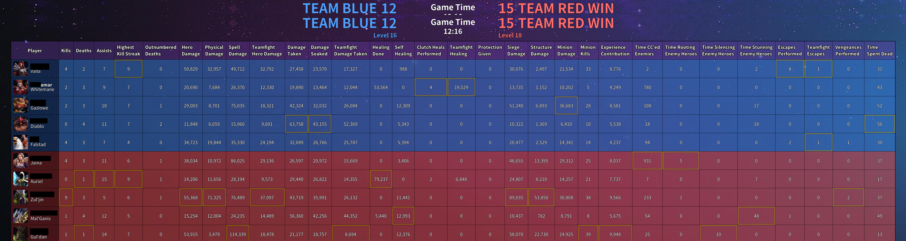

[](https://github.com/RobHaRepos/HotSBot/actions/workflows/ci-build.yaml) [](https://sonarcloud.io/summary/new_code?id=RobHaRepos_HotSBot) [](https://snyk.io/test/github/RobHaRepos/HotSBot) [](https://www.python.org/) 

HotSBot turns a Heroes of the Storm replay (`.StormReplay`) into a readable PNG stats table. It ships as a small FastAPI service (upload/parse endpoint) and an optional Discord bot that posts the generated image. Parsing is powered by Blizzard's `heroprotocol` (vendored in this repo for convenience). Hero portraits are downloaded and cached locally to keep rendering fast and offline-friendly. The codebase is intentionally small: one pipeline to parse → aggregate → render.

**What gets parsed for the table:** the replay header/details for metadata (players, heroes, map, duration) plus tracker events for the actual stat values; game events can also be parsed, but the PNG table is primarily derived from tracker events.

## Example statistic


## Quickstart

### Local (venv)

```powershell
python -m pip install -r requirements.txt
pytest
```

Run the API:

```powershell
python -m uvicorn app.replay_parser.src.parser_api:app --host 0.0.0.0 --port 8000
```

### Docker

```powershell
docker compose up -d
```

## Configuration

- `PARSE_API_URL` (Discord bot) — where to POST the replay upload (defaults to `http://localhost:8000/parse-replay/`).
- `DISCORD_TOKEN` (Discord bot) — the bot token.

## Project structure

- `app/replay_parser/` — main application package.
- `data/replays/` — sample replays for local testing.
- `data/images/heroes/` — cached hero portraits (`.png`) plus URL sidecars.
- `tests/` — pytest suite.
- `heroprotocol/` — vendored upstream dependency (do not modify for this project’s quality goals).

## Key files

- `app/replay_parser/src/parser_api.py` — FastAPI app exposing replay parsing endpoints (path and upload).
- `app/replay_parser/src/parse_service.py` — orchestration layer that runs the replay parse, builds rows, renders PNG, and cleans up artifacts.
- `app/replay_parser/src/statistic_png_renderer.py` — PNG renderer (table layout, fonts, team coloring, best-value highlighting).
- `app/replay_parser/src/extract_replay_header.py` — reads the parsed header output into a typed model.
- `app/replay_parser/src/extract_replay_details.py` — reads the parsed details output into a typed model (players/map).
- `app/replay_parser/src/extract_replay_tracker_events.py` — parses tracker events and converts them into derived stat rows.
- `app/replay_parser/src/extract_replay_tracker_events.py` also contains helpers for parsing event streams; game events support can be added similarly if you want richer timeline analysis.
- `app/replay_parser/src/web_scaper_hero_img.py` — scrapes/downloads hero portraits and maintains a local cache.
- `app/replay_parser/src/discord.py` — Discord bot that uploads replays to the API and posts the PNG result (includes a context-menu delete for bot-authored messages).

## Troubleshooting

- If parsing suddenly fails right after a Heroes of the Storm patch, the replay build may be newer than the bundled `heroprotocol` supports. Update the vendored `heroprotocol/` (or bump the dependency) to a version that includes the new protocol/build, then rebuild your image and re-run tests.

## Optional data (future)

- Talent choices/builds, hero levels, and full team comp (roles).
- Match outcome per player/team and timestamps for major events.
- Map objective timing (e.g., tributes, immortals) and structure damage timeline.
- Chat/message events for pings and team coordination analysis.

## Credits

- `heroprotocol` (Blizzard): https://github.com/Blizzard/heroprotocol
